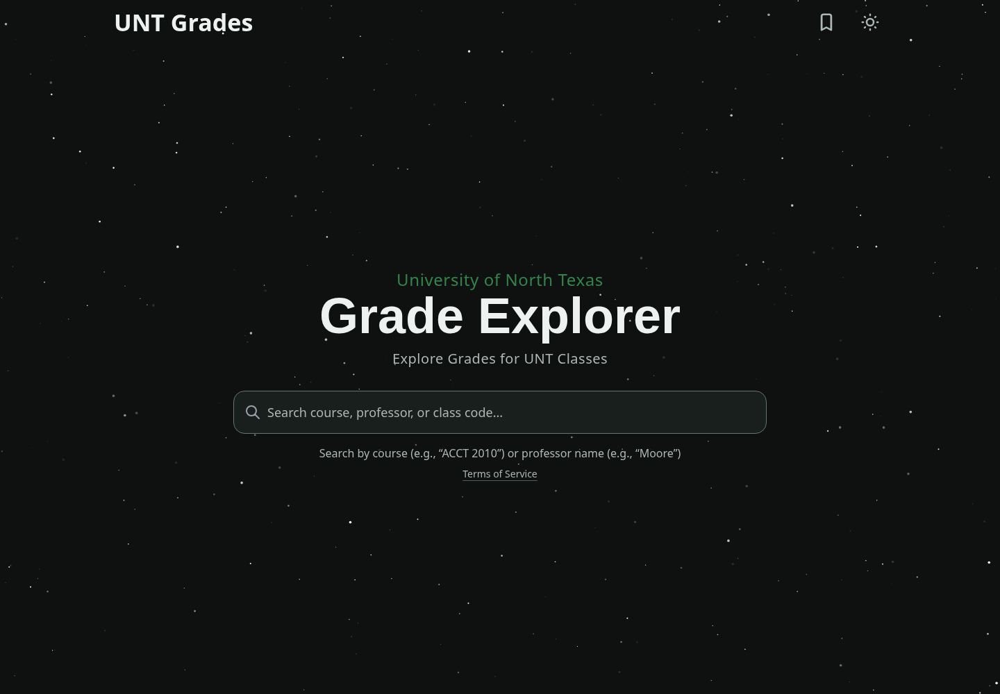
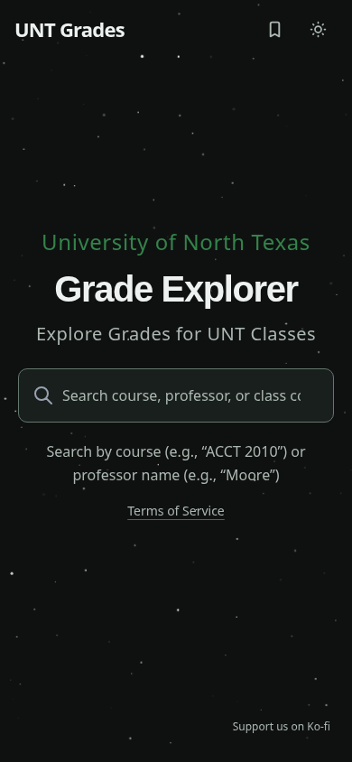

# Approved site theme and stars

The dark theme uses a flat RGB `(15,17,17)` page background, muted `#191f1d` textbox surface, forest-green university label and controls, and white text. The header is transparent without a divider. Search has no outer halo; keyboard focus uses a visible inset line. Desktop retains the original scale and spacing, the navbar title has weight 550, and mobile keeps the compact layout.

The shared layout covers `/`, `/course/[prefix]/[number]`, `/instructor/[id]`, `/cart`, `/compare`, `/search`, `/terms`, `/encrypted-demo`, and the custom 404. Home renders 360 white stars; every other page renders 720. All stars have staggered 3, 3.5, 4, 4.5, or 5 second twinkle cycles and a three-pixel drift over 120 seconds. Stars hide in light mode. Reduced motion disables the stars and respects the preference in both themes. Terms and the demo use the same dark surfaces; demo fields have accessible labels. Light-mode secondary labels and placeholders have stronger contrast, and semester controls wrap without mobile overflow.

Main through `158251307d291ed9e928e1f9c016d26fd057edb1` is incorporated, including #45's system-following theme behavior: initial paint, reloads, and live OS changes honor the system appearance; manual toggles last for the page session. API/data/context, dependencies, extension, credentials, and CI/deployment configuration match that main.

## Video and screenshots

[Watch/download the approved dashboard and front-page MP4](after/dashboard-and-home-3-5-second-twinkle.mp4). This is the exact 44.5-second video delivered to the user: 1440×1000, H.264/YUV420, front page → saved-course dashboard → front page. The video shows the approved 360/720 star density and 3–5 second cycles. Screenshots below are freshly captured from the integrated implementation, with reduced motion so the stars are stable.

| View | Before | Updated dark mode |
| --- | --- | --- |
| Desktop home | [Before](before/home-desktop.png) |  |
| Mobile home | [Before](before/home-mobile.png) |  |
| Course | [Desktop before](before/course-desktop.png) | [Desktop](after/course-desktop.png), [mobile](after/course-mobile.png) |
| Instructor | [Desktop before](before/instructor-desktop.png) | [Desktop](after/instructor-desktop.png), [mobile](after/instructor-mobile.png) |
| Saved courses | — | [Desktop](after/saved-course-desktop.png), [mobile](after/saved-course-mobile.png) |
| Comparison | — | [Desktop](after/compare-desktop.png), [mobile](after/compare-mobile.png) |
| Comparison failure | — | [Desktop](after/comparison-error-desktop.png), [mobile](after/comparison-error-mobile.png) |
| Terms | — | [Desktop](after/terms-desktop.png), [mobile](after/terms-mobile.png) |
| Demo | — | [Desktop](after/encrypted-demo-desktop.png), [mobile](after/encrypted-demo-mobile.png) |
| 404 | — | [Desktop](after/404-desktop.png), [mobile](after/404-mobile.png) |

[All fresh dark screenshots](after) and [all fresh light screenshots](after/light) include search suggestions, keyboard selection, loading, request errors, empty states, and unknown-course/instructor states. Desktop is 1440×1000 and mobile 390×844; [320×740 keyboard/focus preview](after/home-narrow.png) is also included. Some detail screenshots are full-page captures.

Detail charts use a synthetic six-section ACCT 2010/Alex Sample fixture through the unchanged AES-GCM/PBKDF2 client flow. These are presentation checks, not actual UNT grades. No production data key was used. The video's saved-course example also uses synthetic grades.

## Verification

- 167 tests pass: 151 web, 5 extension, 11 CI-script tests. Web and extension production builds, web TypeScript, and changed-file lint pass. Full lint retains 6 baseline errors in untouched tools.
- 65 WCAG A/AA scans pass: 36 route/theme/viewport scans, 24 populated detail scans, 2 comparison-error scans, and 3 keyboard/focus scans. Checked viewports do not overflow horizontally.
- Actual browser checks assert star counts, all five twinkle durations, visible stars through the header, flat dark background, hidden stars in light mode, reduced-motion behavior, and live system-theme updates.
- Functional checks cover chart keyboard tooltips, semester selection, save/remove, saved-data hydration/reload, malformed saved entries, comparison errors, search ArrowDown/Enter logging, options outside the Tab sequence, and Escape/outside-click dismissal/reopening.
- GitHub CI runs on the exact published head. Local Prisma generation used a preinstalled WASM path because the engine-download domain is blocked; repository configuration is unchanged.

To review locally, run `npm run dev -- --webpack` in `unt-grade-distribution`. Visit the routes above in both system themes, change the OS appearance live, reload after a manual toggle, and enable reduced motion. Use Tab to verify focus and ArrowDown/Enter/Escape in search. Check detail views with an existing valid data key. Run `scripts/ci-local.sh`, `npm --prefix unt-grade-distribution run lint`, and `npx tsc --noEmit` in the web app.
