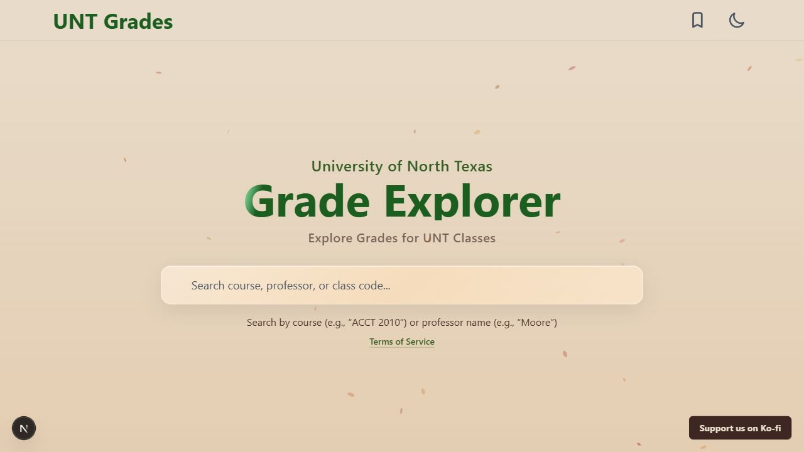
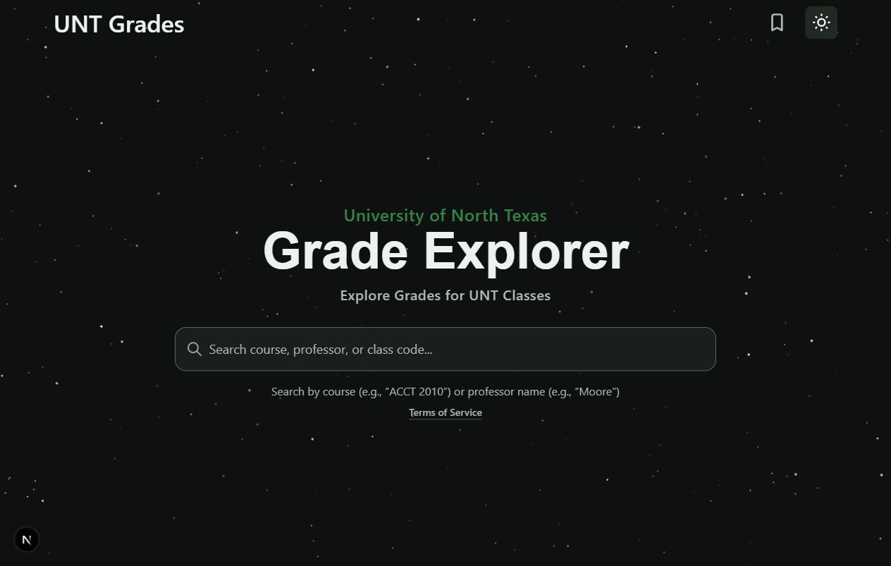

# UNT Grades interface refresh

Homepage comparisons against commit `419c97713778c958f4a73d887959c7f28a3db6f6`.
Screenshots use the local browser's viewport. No fabricated course records or
local encryption keys are included in this change.

| Theme | Before | After |
| --- | --- | --- |
| Light |  |  |
| Dark |  |  |

The real encrypted dataset is preserved. Course and instructor data require the
existing deployment's matching data key; real result pages were not verified
locally without that key.
